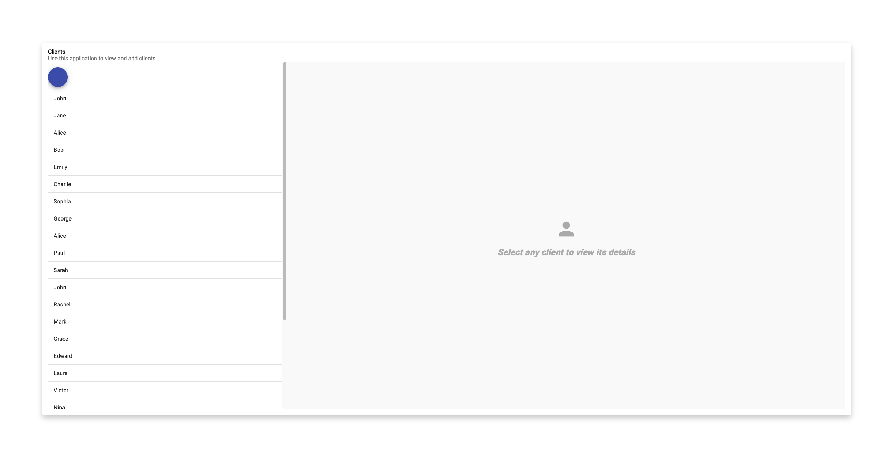

# Angular Assignment

## Description

This application was made in preparation of an interview. The assignment:

> Create a small angular application using angular 16. The application should
> have 2 forms. The first form should allow you to create a client with
> fields like Name, Surname, email and address (street name, post code, house
> number and city). The second form should allow you to view the list of all
> clients and view the details of a selected client. You are allowed to use
> any libraries you like. You do not have to spend too much time on the
> assignment but write the code like you would write it for production.
> Please also let us know how many hours you spent working on this. You can
> send us the github link, or Google or One Drive link for a zip file without
> node_modules folder.

## Features

- List clients
- View client details
- Add new clients
- Real-time updates
- Initial test data

## Prerequisites

- Node.js
- Angular CLI
- Git

## Installation

1. Clone the repository:

```bash
git clone git@github.com:EdwinVanRooij/angular-assignment.git
```

2. Navigate to the project folder:

```bash
cd angular-assignment
```

3. Install dependencies:

```bash
npm install
```

4. Run the development server:

```bash
ng s -o
```

## Usage

Open your web browser and navigate to `http://localhost:4200`.

## Tests

Run the unit tests using:

```bash
ng test
```

> Note: there are no meaningful unit tests for this project. I considered it
> not a priority for this particular exercise.
